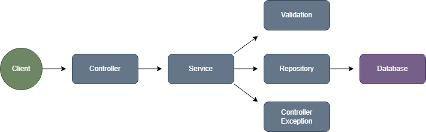
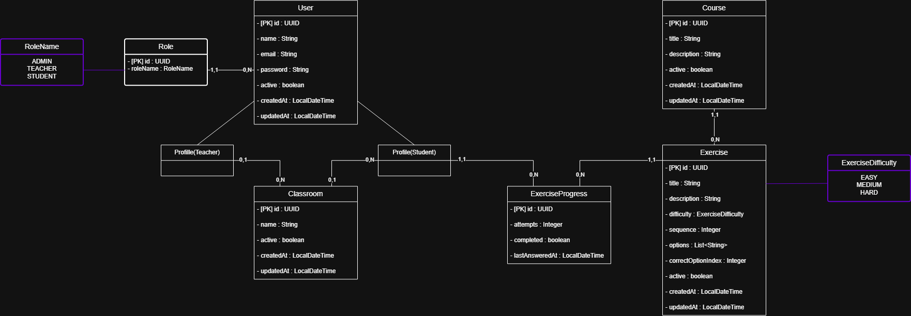

<h1 align="center"><b>SKILLKIDS</b></h1>

### 🎯 **OBJETIVO**

> **SkillKids** é uma aplicação web composta por uma **API RESTful**, desenvolvida em **Java com Spring Boot**, e uma interface de usuário construída utilizando **HTML, CSS e JavaScript**.

> O projeto tem como objetivo oferecer uma plataforma interativa voltada ao ensino de **lógica de programação para crianças**, permitindo o aprendizado de conceitos fundamentais de tecnologia por meio de conteúdos educativos, exercícios e acompanhamento de desempenho.

> Seguindo boas práticas de desenvolvimento limpo **(Clean Code)**, o sistema foi estruturado com foco em organização, escalabilidade e facilidade de manutenção, utilizando **Spring Data JPA** para gerenciamento da persistência dos dados.


#
### 🔧 **FUNCIONALIDADES**

- 🔐 **Autenticação e Controle de Acesso:**  
Implementação de autenticação segura utilizando Spring Security e JWT, permitindo controle de acesso conforme o perfil do usuário: Administrador, Professor ou Aluno.

- 👥 **Gerenciamento de Usuários:**  
Cadastro, consulta, edição, ativação, desativação e exclusão de usuários, com funcionalidades específicas para cada perfil.

- 👨‍🏫 **Gestão de Professores e Turmas:**  
Permite que professores criem e visualizem suas turmas, adicionem ou removam alunos e acompanhem os estudantes vinculados.

- 👧 **Gestão de Alunos:**  
Cadastro de estudantes, associação com turmas e participação por meio do código da turma.

- 📚 **Cursos e Conteúdos Educacionais:**  
Disponibilização de cursos e exercícios voltados ao ensino de lógica de programação, organizados de forma didática para o público infantil.

- 📝 **Exercícios de Múltipla Escolha:**  
Exercícios com diferentes níveis de dificuldade, sequência automática, alternativas e identificação da resposta correta.

- ✅ **Resolução de Exercícios:**  
Permite que alunos respondam aos exercícios, recebam feedback e realizem novas tentativas enquanto o exercício não estiver concluído.

- 📊 **Acompanhamento de Desempenho:**  
Registro das atividades realizadas pelos alunos, permitindo acompanhar exercícios concluídos, tentativas e última atividade.

- 🧑‍🏫 **Painel do Professor:**  
Gerenciamento de turmas, acompanhamento individual dos alunos, consulta dos conteúdos disponíveis e gerenciamento da própria conta.

- 🧒 **Painel do Aluno:**  
Visualização de cursos, resolução de exercícios, acompanhamento do progresso, participação em turma e gerenciamento da própria conta.

- 🛠️ **Painel do Administrador:**  
Gerenciamento de usuários, turmas, cursos, exercícios e dados da conta administrativa.

- 📦 **Data Transfer Objects (DTOs):**  
Utilização de DTOs para padronização das informações trafegadas entre o frontend e a API, garantindo separação de responsabilidades entre as camadas da aplicação.

- ⚠️ **Validação e Tratamento de Exceções Personalizado:**  
Implementação de validações e tratamento global de exceções, garantindo respostas padronizadas e melhor experiência durante o uso da aplicação.

- 💾 **Persistência de Dados com Spring Data JPA:**  
Armazenamento das informações em banco relacional PostgreSQL, utilizando entidades e repositórios JPA para comunicação com a camada de dados.


#
### 👤 **PERFIS DE ACESSO**

A plataforma possui três perfis de usuário:

#### Administrador

- Gerencia usuários;
- Gerencia turmas;
- Gerencia cursos;
- Gerencia exercícios;
- Ativa e desativa registros;
- Atualiza os próprios dados e senha.

#### Professor

- Cria e visualiza suas turmas;
- Adiciona e remove alunos;
- Acompanha o progresso dos estudantes;
- Consulta cursos, exercícios e respostas corretas;
- Atualiza os próprios dados e senha.

#### Aluno

- Visualiza os cursos disponíveis;
- Responde exercícios;
- Acompanha o próprio progresso;
- Entra e sai de uma turma;
- Atualiza os próprios dados e senha.


#
### 🔄 **REPRESENTAÇÃO DE FLUXO**

> A representação de fluxo demonstra a arquitetura geral da aplicação, destacando a comunicação entre o usuário, interface web, API REST e banco de dados.

- **Arquitetura**

<div align="center">
  
</div>


#
### 🧩 **MODELAGEM DE PERSISTÊNCIA**

> Este diagrama apresenta a estrutura das entidades do sistema e seus relacionamentos, auxiliando no desenvolvimento e manutenção da aplicação.

<div align="center">
  
</div>


#
### 📌 **REQUISITOS**

Para executar a plataforma localmente, é necessário ter instalado:

1. **Java 21**  
[Baixar Java 21](https://www.oracle.com/java/technologies/javase/jdk21-archive-downloads.html)

2. **PostgreSQL**  
[Baixar PostgreSQL](https://www.postgresql.org/download/)

3. **Git**  
[Baixar Git](https://git-scm.com/downloads)

4. Uma IDE para o backend, como o **IntelliJ IDEA**  
[Baixar IntelliJ IDEA](https://www.jetbrains.com/idea/download/)

5. Um editor para o frontend, como o **Visual Studio Code**, com a extensão **Live Server**  
[Baixar Visual Studio Code](https://code.visualstudio.com/)


#
### ⬇️ **DOWNLOAD DO PROJETO**

Baixe o projeto em seu computador através do comando:

```bash
git clone https://github.com/Kauan-Ts16/uninter-ae-skillkids-platform.git
```

Depois, acesse a pasta do projeto:

```bash
cd uninter-ae-skillkids-platform
```

**ou**

1. Clique em `<> Code`.
2. Faça o download do arquivo ZIP.
3. Abra o explorador de arquivos na localização do download.
4. Extraia o arquivo ZIP.
5. Abra a pasta extraída em sua IDE.


#
### ⚙️ **CONFIGURAÇÃO**

## Banco de dados

Crie um banco de dados PostgreSQL para a aplicação:

```sql
CREATE DATABASE skillkids;
```

## Arquivo de propriedades

Dentro da pasta:

```text
backend/src/main/resources
```

Utilize o arquivo `application-example.properties` como referência para criar o arquivo:

```text
application.properties
```

O projeto utiliza as seguintes variáveis de ambiente:

```text
DB_URL
DB_USERNAME
DB_PASSWORD
JWT_SECRET
JWT_EXPIRATION
ADMIN_NAME
ADMIN_EMAIL
ADMIN_PASSWORD
```

Exemplo de configuração:

```text
DB_URL=jdbc:postgresql://localhost:5432/skillkids
DB_USERNAME=postgres
DB_PASSWORD=sua_senha
JWT_SECRET=sua_chave_secreta_em_base64
JWT_EXPIRATION=86400
ADMIN_NAME=Administrador
ADMIN_EMAIL=admin@admin.com
ADMIN_PASSWORD=sua_senha_de_administrador
```

A variável `JWT_SECRET` deve possuir uma chave segura codificada em Base64.

A variável `JWT_EXPIRATION` representa o tempo de duração do token em segundos. O valor `86400` corresponde a 24 horas.

O usuário administrador será criado automaticamente na primeira inicialização da aplicação, utilizando as variáveis:

```text
ADMIN_NAME
ADMIN_EMAIL
ADMIN_PASSWORD
```


#
### ▶️ **EXECUÇÃO**

## Backend

Acesse a pasta do backend:

```bash
cd backend
```

No Windows, execute:

```bash
mvnw.cmd spring-boot:run
```

No Linux ou macOS, execute:

```bash
./mvnw spring-boot:run
```

Também é possível abrir a pasta `backend` no IntelliJ IDEA e executar a classe:

```text
BackendApplication
```

Após a inicialização, a API estará disponível em:

```text
http://localhost:8080/skillkids-platform
```

## Frontend

Abra a pasta raiz do projeto no Visual Studio Code.

Com a extensão **Live Server** instalada:

1. Localize o arquivo `frontend/index.html`.
2. Clique com o botão direito sobre o arquivo.
3. Selecione `Open with Live Server`.

O frontend estará disponível normalmente em:

```text
http://127.0.0.1:5500/frontend/index.html
```

O frontend identifica automaticamente o endereço do dispositivo que está executando a aplicação e envia as requisições para a API na porta `8080`.

Para o funcionamento completo, o backend e o frontend devem permanecer em execução simultaneamente.


#
### 🗂️ **ESTRUTURA DO PROJETO**

```text
skillkids-platform
│
├── backend
│   └── src
│       ├── main
│       │   ├── java
│       │   │   └── com.kauanrodrigues.backend
│       │   │       ├── config
│       │   │       ├── controller
│       │   │       ├── dto
│       │   │       ├── enums
│       │   │       ├── exception
│       │   │       ├── mapper
│       │   │       ├── model
│       │   │       ├── repository
│       │   │       ├── security
│       │   │       ├── service
│       │   │       └── validation
│       │   └── resources
│       └── test
│
├── frontend
│   ├── admin
│   ├── student
│   ├── teacher
│   ├── assets
│   │   ├── css
│   │   ├── images
│   │   └── js
│   ├── index.html
│   └── register.html
│
└── docs
    └── diagramas
```


#
### 💻 **TECNOLOGIAS**

#### 🔙 Backend

&nbsp;
&nbsp;
&nbsp;
&nbsp;
&nbsp;
&nbsp;

#### 🌐 Frontend

&nbsp;
&nbsp;
&nbsp;

#### 🛢 Banco de Dados

&nbsp;


#
### 🌐 **DOMÍNIO DA API**

```text
http://localhost:8080/skillkids-platform
```


#
### 📚 **DOCUMENTAÇÃO DA API**

A API segue o padrão REST e possui controllers separados conforme o recurso e o perfil responsável pelo acesso.

A documentação interativa com Swagger não está configurada na versão atual do MVP.


#
### 📌 **ESTADO ATUAL**

O MVP do SkillKids possui:

- Backend integrado ao PostgreSQL;
- Autenticação e autorização com Spring Security e JWT;
- Controle de acesso para Administrador, Professor e Aluno;
- Painel administrativo;
- Painel do professor;
- Painel do aluno;
- Gerenciamento de turmas, cursos e exercícios;
- Resolução e acompanhamento de exercícios;
- Gerenciamento da conta autenticada;
- Integração entre frontend, backend e banco de dados.